# 《小牛视频翻译》(YouTube 油管 搬运) [☛查看下载地址](https://github.com/agan-j/xiaoniu?tab=readme-ov-file#%E4%B8%83%E5%AE%89%E8%A3%85%E8%AF%B4%E6%98%8E)

#### 一、介绍:

《小牛AI视频翻译》是一款视频AI翻译工具。它可以一键将视频中的语音或字幕翻译成中文、英语、日语、法语、韩语等多种语言，轻松实现多语言版本。通过AI技术，它还能生成全新的翻译视频，自动保留背景音效并替换为新的翻译语音，实现声音和嘴型的精准同步。
无论是制作短剧，还是企业推广抖音、TikTok、YouTube等平台的视频，《小牛AI视频翻译》都能助您轻松跨越语言障碍，让视频在全球范围内更广泛地传播与分享。

#### 二、小牛翻译的效果：
<table>
<tr>
<td width="25%">

### 📝 翻译前  
---
https://github.com/user-attachments/assets/72110608-de16-4db1-b390-a8cdc39e3079

</td>
<td width="25%">

### 🌍 翻译后  
---
https://github.com/user-attachments/assets/e598dabb-fa43-416a-a9ca-e533f5894b33

</td>
<td width="25%">

### 📝 翻译前  
---
https://github.com/user-attachments/assets/660d8563-6331-4d29-abe8-de08062628e2

</td>
<td width="25%">

### 🌍 翻译后  
---
https://github.com/user-attachments/assets/79dd3d0b-0c10-4cbe-84dd-aae1ab41ec74

</td>
</tr>
<tr>
<td width="25%">

https://github.com/user-attachments/assets/f4ff67cc-dd8f-448b-ab18-ac91c3dd190e

</td>
<td width="25%">

https://github.com/user-attachments/assets/10df7ce5-eac5-4907-9609-261fcd1a5f78

</td>
<td width="25%">

https://github.com/user-attachments/assets/1b2f6d84-c139-4f37-8ee4-405adfa51a30

</td>
<td width="25%">

https://github.com/user-attachments/assets/49203f91-71b7-4a74-8bee-69b84f7aec9b

</td>
</tr>
</table>

#### 三、核心功能:
1. **视频翻译：** 一键翻译视频中的语音或字幕为中文、英语、日语、法语、韩语等多种语言，支持本地和YouTube视频，让您轻松创建多语言版本，拓展全球传播。
2. **字幕翻译：** 自动生成多语言字幕，并提供多种字幕样式选择，让视频内容更直观地传达给全球观众。
3. **字幕转语音：** 借助AI技术，将字幕内容转换为音频，支持多种男女声线选择，实现声音与画面的精准对齐，使语音与口型同步，提升观众体验。
4. **语音转字幕：** 智能识别视频语音并生成字幕，支持多语言，免去手动添加字幕的繁琐，帮助创作者轻松制作多语言视频，扩大内容影响力。
5. **人声分离与翻译：** 自动分离背景音乐和人声，将人声翻译为其他语言音频（例如，将英文转为中文），保留背景音乐，增强视频的沉浸感。
6. **创作Web UI界面：** 在视频观看时实时修改字幕内容和语音，界面简洁易用，创作者可以迅速调整视频表现形式，充分发挥创意，使视频内容更贴合您的意图，提升您的个性化创作体验。

#### 四、小牛的核心技术

#### 1、自建小牛字幕翻译模型
自研 AI 字幕翻译模型，基于涵盖 100 万部视频字幕的数据集，采用 深度微调（CPT、SFT 、DPO） 训练而成，显著增强了字幕翻译的 语义理解与精准表达能力。  
经过调校优化的上下文理解机制，使模型能够充分把握视频整体内容，在翻译时灵活调整词句，确保译文更符合真实语境，避免生硬直译。  
同时，经过调校改进的多语言匹配技术使模型能更准确地捕捉并修正不同语言间的细微差别，特别是在短语转换、省略句处理和复杂句结构优化上，实现了更自然、流畅的翻译效果。

#### 2、小牛翻译5步法：
1. **理解核心：** 首先深入理解视频的主旨和核心信息。通过这一过程提取出清晰的大纲和简洁的摘要，确保AI对视频内容有全面而深刻的理解，为后续翻译奠定坚实的基础。  
2. **语境翻译：** 根据视频的大纲和摘要，把字幕翻译成目标语言。确保翻译后的字幕既保留原视频的意思和情感，又容易理解。  
3. **文化调整：** 针对意译的结果，根据目标语言的文化背景和表达习惯，对翻译文本进行适当调整。这一步骤旨在使翻译后的文本更加自然流畅、易于被目标语言的观众理解和接受。  
4. **反思调整：** AI对翻译结果自动评估，检测并修正文化语义偏差、流畅度问题及风格一致性等方面的问题。结合AI模型给出的优化建议，对译文进行必要的迭代改进，确保最终翻译的准确性与可读性。  
5. **字幕精校：** 最后对翻译好的字幕进行全面检查，确保字幕与视频同步准确无误，语言表述精准，格式规范统一。任何遗漏或错误都应在此阶段得到纠正，以确保字幕质量的整体提升和良好的观看体验。

#### 五、开源计划：取决于社区反馈 
小牛是否开源，完全取决于你的声音！我们相信，开源的真正价值来自于社区的支持和参与。如果你希望小牛开源，或者有创意想法和实际需求，欢迎在 **[Issues](https://github.com/agan-j/xiaoniu/issues)** 中踊跃提出。  

#### 六、系统展示：
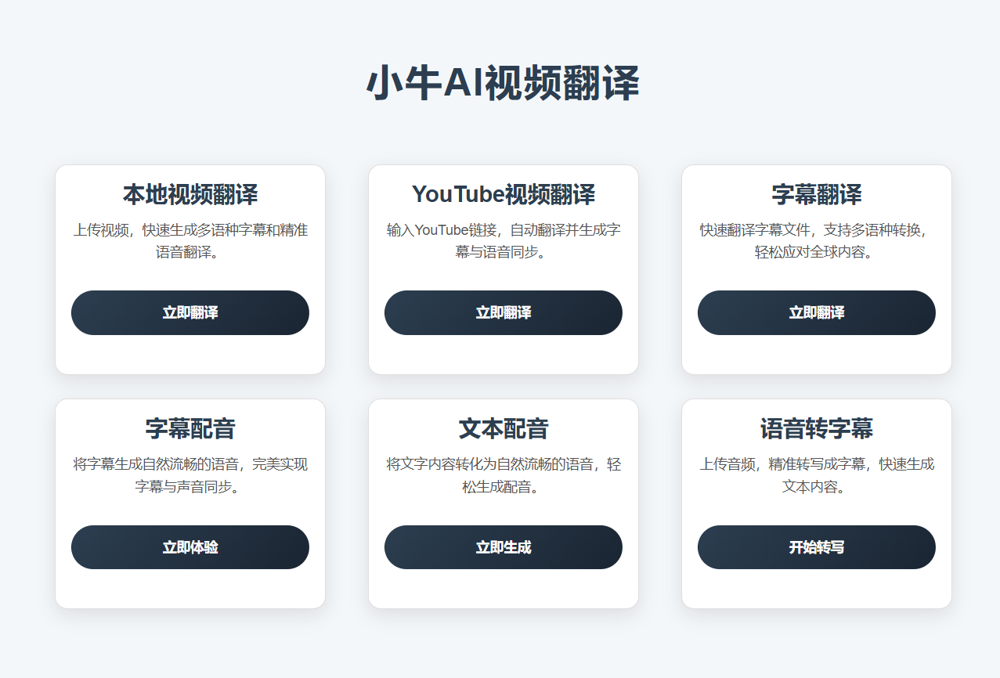
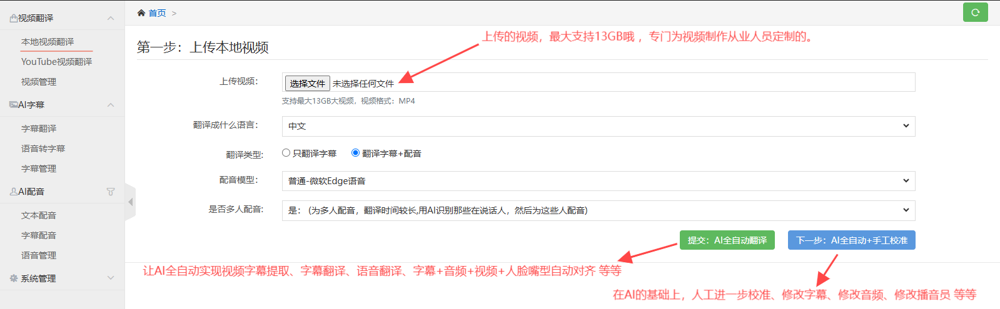
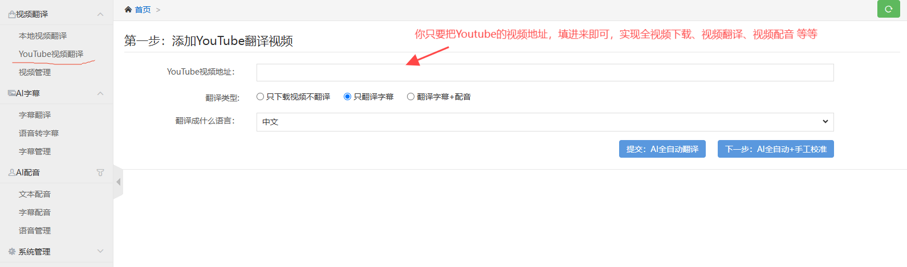
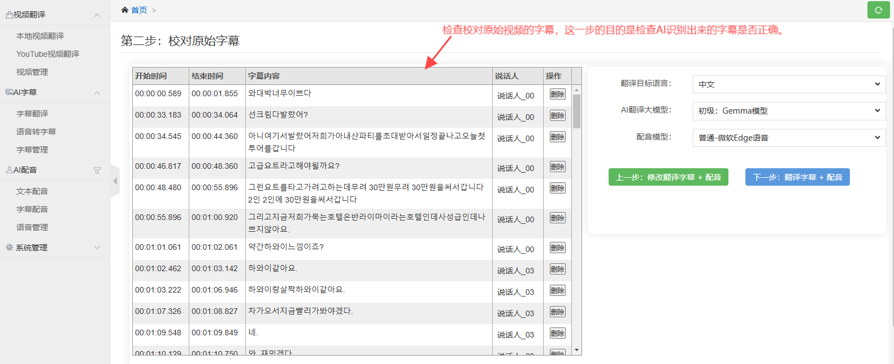
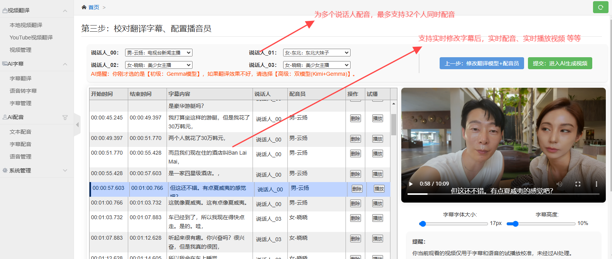
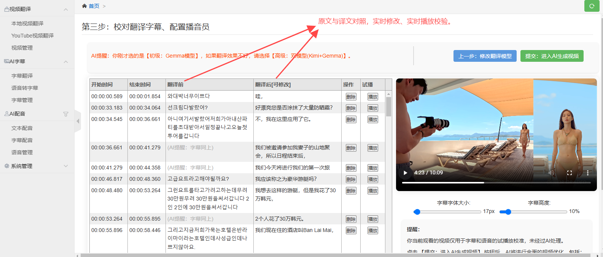
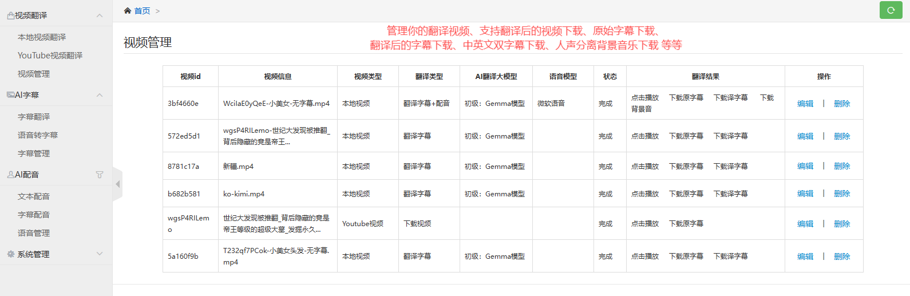
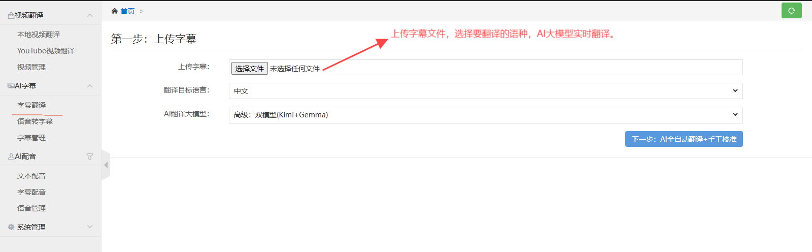
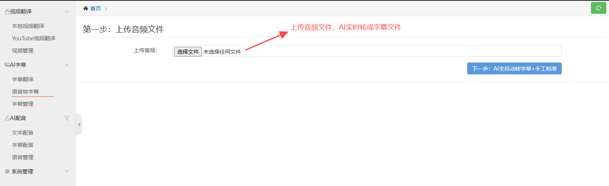
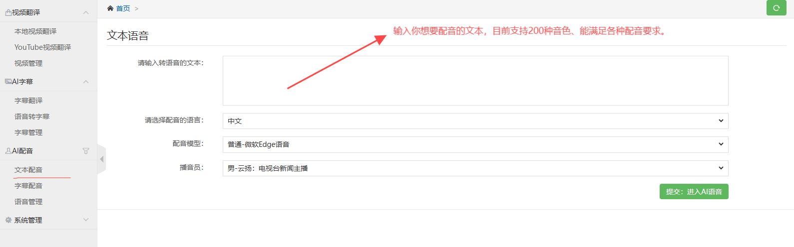
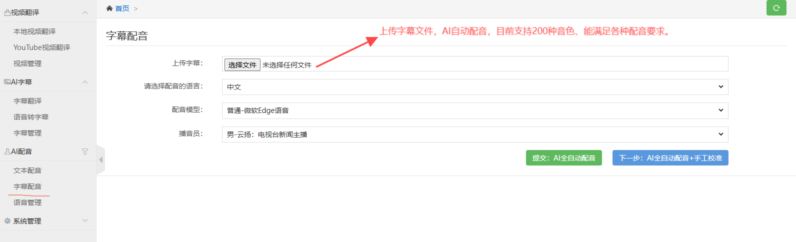

#### 七、安装说明
## **第一步：下载绿色版本**  
根据你的电脑配置选择对应的版本，绿色版无需安装，解压即可使用。

### **CPU版本**
- **百度网盘**：https://pan.baidu.com/s/1MdKsys8VlxZilt6GwREoYg?pwd=8888` 
- **夸克网盘**：https://pan.quark.cn/s/79c7cfd4685e
- **123云盘**（不限速）：https://www.123pan.com/s/vLQ9-Ofw4.html
- **天翼云盘**（不限速）：https://cloud.189.cn/web/share?code=jye6vif6Vf6r（访问码：dok7）

### **GPU版本**（适合有独立显卡的用户）
- **百度网盘**：https://pan.baidu.com/s/1S50h3-Jcskp-GCVayx0FCQ?pwd=8888
- **夸克网盘**（不限速）：https://pan.quark.cn/s/47fd486b7f82
  
### **模型文件**（建议提前下载）  
如果不提前下载，软件运行时会自动下载，但速度可能较慢。  
- **百度网盘**：https://pan.baidu.com/s/1aa9FUhkEX46DJ2TWpYUErg?pwd=8888
- **天翼云盘**（不限速）：https://cloud.189.cn/t/neQ3y2uMr6Vv （访问码：bi9y）
---

## **第二步：启动软件**  
我们的绿色版本不需要安装，操作非常简单：  
1. **解压文件**：下载后，将压缩包解压到任意位置。  
2. **运行软件**：双击运行 `小牛视频翻译`。  
3. **访问界面**：打开浏览器，输入地址：http://127.0.0.1:8181/home

##### 如果您在使用过程中遇到任何困难，请联系作者微信：xiaoniu203040 帮您解决。

## 软件更新历史记录

### 2025年8月27日
字幕配音，支持多角色自动识别，自动配音，也可以自动克隆音色配音。

---

### 2025年8月17日
增加了字幕的免费字体、字体颜色、字体大小、字体高度、描边粗细、描边颜色等6大字幕样式功能

---

### 2025年7月27日

上线「上传字幕」功能，跳过转写直达成片，省时省钱更省心：

1. 一键导入字幕+视频，即可直接翻译或配音；
2. 全流程跳过“视频转写”环节，节省时间与转录成本；
3. 生成视频自动同步“视频+音频+字幕+画面+嘴型+音速”，六维一致性一步到位。

---
### 2025年7月24日

新增声音克隆功能，支持 IndexTTS 和 cosyvoice-v2 两大主流模型，语音生成更自然、更智能：

1. 支持情感克隆配音，可还原说话人的语气、语调与情绪，实现更真实、生动的语音表现；
2. 支持最多100个角色，实现全自动克隆配音，特别适用于多角色短剧的语音生成需求。

---

### 2025年7月14日  

解决视频翻译中，AI生成视频后，音频和人物动作不协调问题；例如演讲发布会上，演讲人的声音和手动作 协调一致性问题。

---

### 2025年7月8日  
发布了“画面 + 音频 + 字幕 + 嘴型 + 音速” 对齐的稳定版本202500708。
相比上一版本，该版本的对齐准确率提升了 50%。
特别感谢过去 40 天内200+ 位用户的积极反馈与建议，很多用户甚至将翻译效果不佳的视频发给我进行研究与优化，真的非常感谢大家的信任与支持！

---

### 2025年6月16日  
- 《基于 AI 的嘴型与画面驱动音频速率调整，最终保证 视频+音频+字幕+画面+嘴型+音速的一致性。》  
1、基于嘴型与画面节奏的音频动态速率调整  
引入智能嘴型识别与画面帧速分析技术，自动调整音频播放速率，使语音内容与人物口型、动作节奏精准匹配，从而提升视听一致性和沉浸感。  
背后应用了基于深度学习的嘴型识别模型与节奏分析算法，实现了更自然、智能的音画对齐。  
2、解决视频“画面慢动作”问题  
本次通过引入多模态融合模型，融合嘴型识别、人物动作轨迹分析与音频节奏建模，优先保留视频原始节奏结构，并通过 AI 驱动的音频速率动态重建，完成时长对齐，彻底避免画面被强行减速的情况，确保整体画面流畅自然。

---
### 2025年5月30日  
- 重构打磨《小牛翻译5步法》（1.理解核心 2.语境翻译 3.文化调整 4.反思调整 5.字幕精校），翻译准确性提升15%； 用心打磨产品，请小伙伴们享用。

---
### 2025年5月18日  
- 节约你的成本：本次主要是优化配音，在保证音质的条件下，节约配音成本。比以前能节约50%的成本吧。

---

### 2025年5月05日  
- 解决翻译丢字幕问题。增加翻译葡萄牙语种。

---

### 2025年4月20日  
- 本次版本升级针对搭载 Apple 芯片（如 M1、M2、M3、M4 系列）的 Mac 设备进行了深度优化。通过全面支持 Apple 芯片的 Metal Performance Shaders（MPS）加速能力，性能相比此前版本提升高达 7倍，大幅提升运行效率与响应速度，充分发挥 Apple 硬件的计算优势。另外也 解决了mac的一些报错bug.

---
### 2025年4月7日  
- 视频出海更容易了！中文语音转字幕准确率达99%，支持23种方言: 小牛已经支持23种方言（上海话、四川话、武汉话、贵阳话、昆明话、西安话、郑州话、太原话、兰州话、银川话、西宁话、南京话、合肥话、南昌话、长沙话、苏州话、杭州话、济南话、天津话、石家庄话、黑龙江话、吉林话、辽宁话）；

---

### 2025年3月31日  
- 优化翻译和播音性能，速度在原来的基础上能提升5-10倍。

---

### 2025年3月17日  
- 新增了翻译万能接口，支持所有遵循通用OpenAI兼容接口格式的翻译服务接入，只需提供apiKey、baseURL和model参数即可实现无缝对接。
- 持续优化小牛翻译五步法（理解核心、语境翻译、文化调整、反思调整、字幕精校），确保翻译结果更加准确自然，贴合实际使用场景。

---

### 2025年3月10日  
- 接入DeepSeek翻译模型，翻译更加精准。
- 继续优化了小牛翻译5步法(理解核心、语境翻译、文化调整、反思调整、字幕精校)，翻译更加精准。

---

### 2025年2月20日  
- 解决了YouTube限制下载问题。

---
  
### 2025年1月24日  
- **字幕翻译准确率提升10倍**  
  - 自研AI字幕翻译模型，基于100万部视频字幕数据进行深度训练，采用最新的 Transformer 架构，显著提升字幕翻译的语义理解与精准表达能力。  
  - 引入上下文感知机制，能够根据视频内容动态调整翻译结果，确保翻译语言更加符合语境逻辑。  
  - 应用多语言对齐技术，优化语言间的细节翻译误差，特别针对短语、省略句等复杂结构实现更高准确率。  
  - 加速推理效率，翻译处理时间缩短 30%，为用户提供更快速的字幕翻译服务。  

---
### 2025年1月11日  
#### 全面升级视频双字幕功能  

为了提升多语言视频的制作和观赏体验，本次我们对双字幕功能进行了关键升级，特别在**精准的双字幕同步**和**翻译精准度**方面做出了显著提升。以下是本次升级的重点：  

1. **精准的双字幕同步**  
   - 新版本优化了字幕与视频的同步机制，确保两种语言字幕始终保持精准同步，避免错位或延迟。  
   - 增强的字幕时间轴校准工具，支持用户手动微调字幕的时间轴，保证每一句话的字幕与语音精准对接，适用于高精度需求的视频内容。  

2. **翻译精准度提升**  
   - 升级后的翻译引擎显著提高了翻译的准确性，特别是在处理专业术语和上下文语义时，能够更好地保留原意。  
   - 结合上下文分析，智能优化翻译内容，避免传统翻译中的歧义，确保翻译结果自然流畅，更符合目标语言的表达习惯。  
   - 支持更多语言对的精准翻译，满足国际化内容的需求，确保双语字幕在全球观众中的高质量呈现。  

本次升级在同步精准度和翻译质量方面的提升，将大大增强视频内容的跨语言传播效果，满足更高标准的专业视频翻译需求。

---

### 2024年12月29日  
- **美化字幕，按语义切割字幕**  
  - 新增智能语义分析功能，将字幕按语义进行切割，每条字幕不超过30字；解决了字幕过长、不合理断句、无标点符号的问题，让字幕更加清晰易读。  
  - 优化断句规则，自动添加适当标点符号，提升字幕的流畅度和阅读体验。  
  - 引入动态长度检测算法，确保字幕在多种语言下均能保持视觉友好，不影响用户观看体验。
  - 
### 2024年12月3日  
- **优化字幕翻译对照体验**  
  - 改进了字幕翻译界面，提供更清晰、易读的对照展示方式;让用户可以快速查看原文与翻译的对照内容，提升翻译体验。  
  - 引入智能排版算法，使翻译内容更加整洁、对齐，避免字幕重叠或显示错乱。

- **修复翻译过程中系统卡死Bug，提升系统稳定性**  
  - 修复了在字幕翻译过程中系统偶尔卡死的问题，优化了后台处理流程，确保翻译过程更加流畅。  
  - 增强了多线程处理能力，优化了内存管理，有效避免翻译任务长时间运行时导致的系统崩溃或卡顿现象。  
  - 系统响应速度更快，翻译任务完成更加高效，提升用户体验。

---

### 2024年11月25日  
- **新增字幕配音功能**  
 
  - 支持通过字幕文件直接生成语音。  
  - 集成微软TTS、字节跳动火山语音及真人ChatTTS三大语音技术，提供自然流畅的声音体验。  
  - 适用于课程讲解、宣传视频、有声读物等多种场景，为您的创作提供全新可能！  

- **新增中英文双字幕功能**  

  - 同时支持中文和英文双语字幕的自动生成与同步。  
  - 字幕风格灵活可调，支持中英对照模式和分行显示。  
  - 打造更加国际化的视频内容，让您的作品更具吸引力！ 

---

### 2024年11月18日
- **新增文本配音功能**

  我们新增了文本配音功能，现在您可以轻松将文字转换成语音。这个功能使用了微软TTS、字节跳动火山语音和真人ChatTTS三种先进的AI语音技术。
  只需输入或粘贴文字，选择喜欢的声音类型，就能生成高质量的语音。无论是做课程讲解、有声书，都能让您的工作更高效、更方便。

---

### 2024年11月15日
- **接入新的语音助手——ChatTTS，增加了40种真人声音**

  我们在最新的版本中加入AI语音技术叫做ChatTTS，这让我们的应用能够提供更加自然、真实的语音播放效果。这次更新，我们特别添加了40种新的AI声音选项，这些声音都是根据真实人的声音制作出来的，听起来就像真人说话一样自然。这意味着，无论你是想做教学视频、朗读小说，还是制作新闻播报，都可以从这40种新声音中挑选最适合的一种来使用，让你的作品听起来更加生动有趣。
  
---

### 2024年11月05日
- **接入头条火山语音引擎，新增80个智能AI播音员**

  此次更新接入了头条火山语音引擎，进一步丰富了语音合成功能，新增了80个智能AI播音员。用户现在可以根据需要选择不同的语音风格和语调，使视频内容的表达更加生动、个性化。无论是新闻解说、广告配音还是故事讲述，都能找到最合适的声音配合，提升整体的视听效果。
  
---

### 2024年9月22日
- **新增本地视频翻译功能，持续优化字幕翻译体验**

在此次更新中，正式上线本地视频翻译功能，提升用户处理本地视频的效率和灵活性。

  主要更新内容：
  
  本地视频翻译功能：支持用户上传本地视频进行翻译，进一步满足了用户对非在线内容处理的需求。
  
  字幕翻译优化：在已有的字幕翻译和手工校对功能基础上，本次更新优化了字幕生成的准确度和编辑便捷性。
  
  版本更新背景：
  
  自从9月初推出全新的可视化Web UI系统后，用户对我们的视频翻译和字幕校对功能反响热烈。许多用户表示，希望进一步支持本地视频文件的翻译需求。因此，经过技术团队的努力，我们很高兴能够在此次更新中满足这一需求，继续优化您在使用时的整体体验。
  
---

### 2024年9月2日
- **全新可视化Web UI系统，支持手工校对字幕和翻译语音功能**

  此次更新带来了全新的可视化Web UI系统，大幅提升了用户体验和操作便捷性。新增功能包括视频管理、视频翻译添加、字幕翻译管理，以及手工校对字幕等。
  
  版本更新背景：近半年来，我们收到许多用户反馈，大家希望在AI翻译字幕的基础上，能够进一步手动修改和优化字幕内容。同时，用户还希望能够在视频中添加个人见解，进行个性化的视频解说。

  为了满足这些需求，本次版本特别推出了手工校对字幕和翻译语音功能。现在，用户可以在观看视频时，实时修改字幕内容和视频语音，充分发挥创意，使视频内容更加符合个人表达意图。这一功能的加入，将帮助您更高效地优化视频质量，为受众提供更加丰富的观看体验。
---

### 2024年8月13日
- **引入双AI模型策略，翻译精准度的显著飞跃**  
在过去的几个月中，我们收到了许多用户关于翻译结果精准度的反馈。尽管我们之前采用了机器翻译和ChatGPT技术，但实际应用中的翻译效果并未完全达到用户的期望。  
经过深入的技术分析，我们认识到单一AI模型在提升翻译质量方面存在局限。为了解决这一问题，我们采用了两个模型同时进行翻译，这一策略显著提高了翻译的准确性。  

- **本次更新，我们新增了两个AI翻译大模型，以提供更高质量的翻译服务:**   
**1、初级-Gemma模型：** 专为视频解说类翻译设计，准确率可达90%。Gemma是由谷歌发布的大规模语言模型，擅长生成高质量的翻译文本。我们还对其进行了针对翻译场景的模型微调，以进一步提升翻译效果。  
**2、高级-双模型(Kimi+Gemma)：** 结合了Kimi和Gemma两个模型的优势，针对视频解说类内容，翻译准确率可达到98%。Kimi作为国内知名的AI大模型，与Gemma模型的结合，为翻译效果带来了质的飞跃。  
我们相信，这次技术的更新和模型的升级将为您带来前所未有的翻译体验。期待您的反馈和建议，以帮助我们不断优化服务。  
---

### 2024年7月25日
- **引入了先进的音质提纯技术，为您带来更加清晰和震撼的听觉体验：**
事情是这样的：三个月前，一些用户向我们反映音质不好，杂音和嘈杂声太多。前期苦于技术的限制，但我们历经3个月技术攻克，最终成功突破。
- **因此，在本版本中我们增加了5个音质选项：**
1. 去除背景音：只保留人声，没有原始背景音乐。
2. 普通音质：采用普通音频提纯方法，提取音质速度快，10分钟的视频大约只需30秒。
3. 普通音质-去噪音：在普通音质的基础上，使用15种算法去除噪音，例如国际上最好的WaveNet。
4. 顶级音质：采用顶级音频提纯方法，使用国际上最好的Wav2Vec、Conv-TasNet、D3Net、SEGAN 等技术；提取音质速度较慢，10分钟的视频大约需要10分钟。
5. 顶级音质-去噪音：在顶级音质的基础上，使用15种算法进一步去除噪音。
---
### 2024年7月10日
- **精准同步声音与说话口型**：通过深度学习算法分析视频内容，实现智能配音，精准匹配声音与视频中的说话口型。AI技术极大提升了视频观看体验，使配音更加自然和逼真，广泛应用于电影、电视剧、企业宣传等领域。
---
### 2024年5月20日
- **新增ChatGPT翻译**：普通翻译工具（如谷歌翻译、百度翻译）常导致语义不通、上下文僵硬等问题。借助ChatGPT大模型翻译，可以彻底解决这些问题，提供更加流畅和自然的翻译效果。
---
### 2024年4月10日
- **Y新增视频裁剪**：提供精准的时间段选择和剪辑功能，让您根据需求对视频进行裁剪（去头去尾）和编辑。
---
### 2024年3月10日
- **分离语音中的人声和背景音乐**：利用AI技术将视频中的人声和背景音乐分离，并将人声翻译成中文，同时保留背景音乐，使得视频更易理解和欣赏。
---
### 2024年2月20日
- **新增视频翻译**：YouTube上的视频多为外国语言，国人难以理解。为此，我们增加了语言翻译功能，将全球视频内容翻译为中文语音，方便用户观看。
---
### 2024年1月10日
- **新增字幕翻译**：支持下载视频字幕并自动翻译为中文字幕，提升用户的观看体验。
---
### 2023年12月15日
- **新增YouTube视频管理**：针对YouTube视频数量庞大且难以管理的问题，我们增加了Excel管理视频功能，使视频管理更加高效便捷。
---
### 2023年10月5日
- **YouTube下载**：支持YouTube视频的自动化下载，方便用户离线观看。

