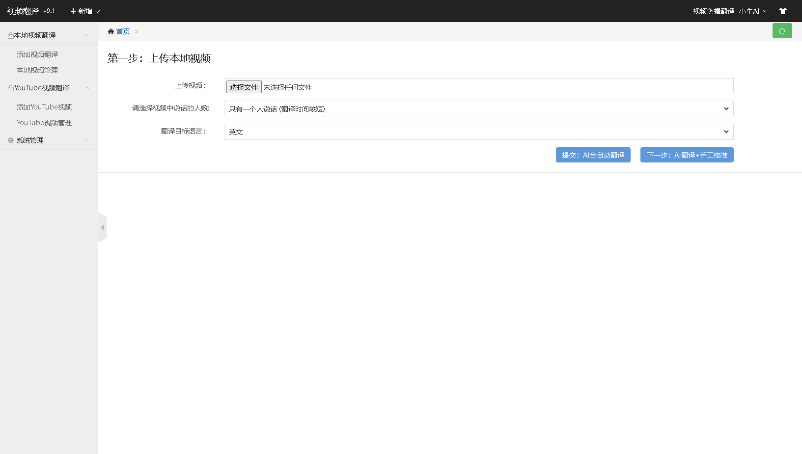
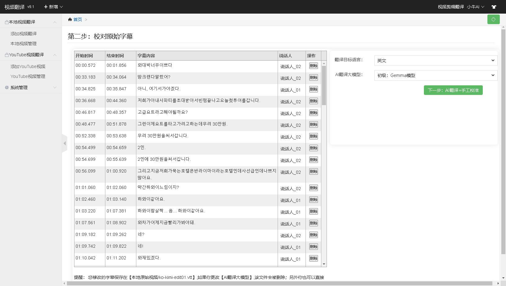
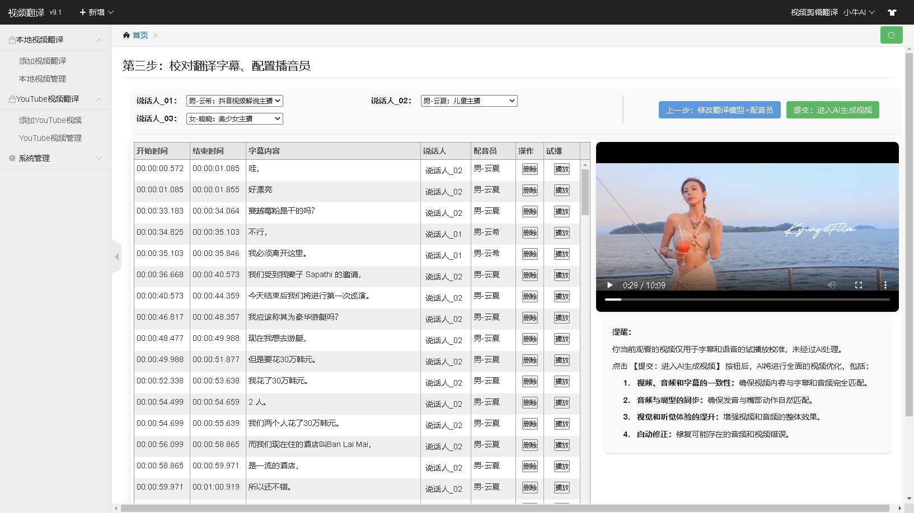
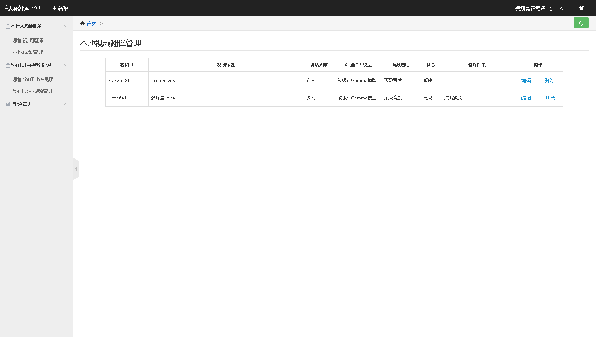
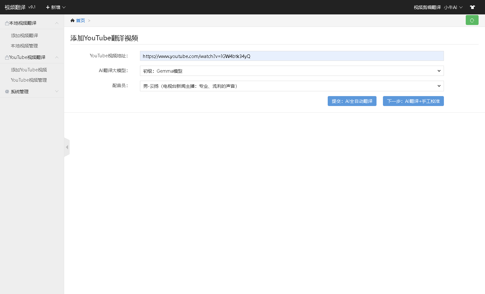
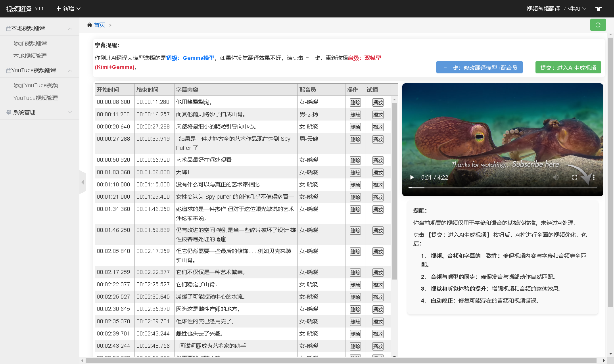
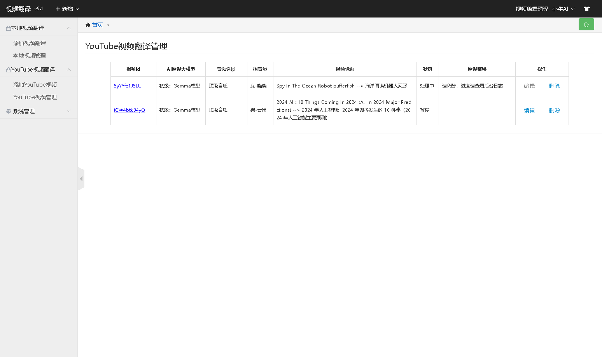

# 《小牛视频翻译》(YouTube 油管 搬运) [☛查看下载地址](https://github.com/agan-j/xiaoniu?tab=readme-ov-file#%E5%9B%9B%E5%AE%89%E8%A3%85%E8%AF%B4%E6%98%8E)
#### 一、介绍:

《小牛视频翻译》是一款智能AI翻译视频处理工具。首先，它能够将全球视频的语音和字幕自动翻译为中文语音和字幕，让用户更轻松地理解视频内容。其次，借助AI技术，可以生成全新的视频，让用户获得全新的视听体验。让你更好的学习全世界知识。

#### 二、核心功能:
1. **视频翻译：** 将全球各种语言的视频语音智能翻译为中文，助您轻松理解视频内容。
2. **字幕翻译：** 自动将全球视频的字幕内容翻译为中文，直观呈现视频信息，助您更深入了解视频内容。
3. **AI智能配音：** 通过AI技术对视频字幕进行智能配音，支持多种男女声音，并且基于智能AI技术，实现声音与视频画面的对齐，使声音与说话口型基本一致。
4. **ChatGPT翻译：** 普通翻译的主要问题在于，将其他国家的语言翻译为中文时，可能导致语义不通、上下文僵硬等问题。借助ChatGPT大模型翻译，可以根本解决这一问题，确保翻译内容更加符合中国人的思想，语义通顺，不会显得生硬。
5. **人声分离：** 利用AI技术处理视频音频，分离背景音乐和人声，然后使用OpenAI将人声翻译为各国语言（例如，将英文音频翻译为中文音频）。
6. **视频裁剪：** 提供精准的时间段选择和剪辑功能，让您根据需求对视频进行裁剪和编辑。
7. **智能下载：** 支持从YouTube等平台智能下载视频，方便快捷地获取源视频。
8. **创作Web UI界面：** 您在观看视频时，可实时修改字幕内容和视频语音。通过简洁易用的界面，您能够迅速且灵活地调整视频的表现形式，充分发挥创意，使视频内容更贴合您的意图，提升您的个性化创作体验。

#### 三、小牛翻译的效果：
<table>
  <tr>
    <th>翻译前</th>
    <th>翻译后</th>
  </tr>
  <tr>
    <td><a href="https://www.bilibili.com/video/BV14aHZeXEgX" target="_blank">视频解释-《泥跳鱼》-原版</a></td>
    <td><a href="https://www.bilibili.com/video/BV14aHZeXEuk" target="_blank">视频解释-《泥跳鱼》-翻译版本</a></td>
  </tr>
    <tr>
    <td><a href="https://www.bilibili.com/video/BV1p3txezEfU" target="_blank">多人对话-《男女旅游对话》-韩文转中文-原版</a></td>
    <td><a href="https://www.bilibili.com/video/BV1A3txe6EZM" target="_blank">多人对话-《男女旅游对话》-韩文转中文-翻译版本</a></td>
  </tr>
    <tr>
    <td><a href="https://www.bilibili.com/video/BV1T3sCeXERM" target="_blank">多人对话-《李飞飞融资2.3亿美元，彭博社采访》-原版</a></td>
    <td><a href="https://www.bilibili.com/video/BV1mgsCepEbk" target="_blank">多人对话-《李飞飞融资2.3亿美元，彭博社采访》-翻译版本</a></td>
  </tr>
</table>

#### 四、系统展示：

#### 四、安装说明
##### 第一步：下载绿色版本
- 百度网盘：https://pan.baidu.com/s/1MdKsys8VlxZilt6GwREoYg?pwd=8888
- 夸克网盘：https://pan.quark.cn/s/79c7cfd4685e
- 123云盘： https://www.123pan.com/s/vLQ9-Ofw4.html
- 天翼云盘：https://cloud.189.cn/web/share?code=bqqymqMjY3mu（访问码：55lj）

##### 第二步：安装
我们提供绿色版本，无需安装。  
1、 解压后执行：小牛视频翻译.exe  
2、 打开网址：http://127.0.0.1:8181/main

##### 如果您在使用过程中遇到任何困难，请联系作者微信：xiaoniu203040 帮您解决。

## 软件更新历史记录
### 2024年9月22日
- **新增本地视频翻译功能，持续优化字幕翻译体验**

在此次更新中，正式上线本地视频翻译功能，提升用户处理本地视频的效率和灵活性。

  主要更新内容：
  
  本地视频翻译功能：支持用户上传本地视频进行翻译，进一步满足了用户对非在线内容处理的需求。
  
  字幕翻译优化：在已有的字幕翻译和手工校对功能基础上，本次更新优化了字幕生成的准确度和编辑便捷性。
  
  版本更新背景：
  
  自从9月初推出全新的可视化Web UI系统后，用户对我们的视频翻译和字幕校对功能反响热烈。许多用户表示，希望进一步支持本地视频文件的翻译需求。因此，经过技术团队的努力，我们很高兴能够在此次更新中满足这一需求，继续优化您在使用时的整体体验。
  
---

### 2024年9月2日
- **全新可视化Web UI系统，支持手工校对字幕和翻译语音功能**

  此次更新带来了全新的可视化Web UI系统，大幅提升了用户体验和操作便捷性。新增功能包括视频管理、视频翻译添加、字幕翻译管理，以及手工校对字幕等。
  
  版本更新背景：近半年来，我们收到许多用户反馈，大家希望在AI翻译字幕的基础上，能够进一步手动修改和优化字幕内容。同时，用户还希望能够在视频中添加个人见解，进行个性化的视频解说。

  为了满足这些需求，本次版本特别推出了手工校对字幕和翻译语音功能。现在，用户可以在观看视频时，实时修改字幕内容和视频语音，充分发挥创意，使视频内容更加符合个人表达意图。这一功能的加入，将帮助您更高效地优化视频质量，为受众提供更加丰富的观看体验。
---

### 2024年8月13日
- **引入双AI模型策略，翻译精准度的显著飞跃**  
在过去的几个月中，我们收到了许多用户关于翻译结果精准度的反馈。尽管我们之前采用了机器翻译和ChatGPT技术，但实际应用中的翻译效果并未完全达到用户的期望。  
经过深入的技术分析，我们认识到单一AI模型在提升翻译质量方面存在局限。为了解决这一问题，我们采用了两个模型同时进行翻译，这一策略显著提高了翻译的准确性。  

- **本次更新，我们新增了两个AI翻译大模型，以提供更高质量的翻译服务:**   
**1、初级-Gemma模型：** 专为视频解说类翻译设计，准确率可达90%。Gemma是由谷歌发布的大规模语言模型，擅长生成高质量的翻译文本。我们还对其进行了针对翻译场景的模型微调，以进一步提升翻译效果。  
**2、高级-双模型(Kimi+Gemma)：** 结合了Kimi和Gemma两个模型的优势，针对视频解说类内容，翻译准确率可达到98%。Kimi作为国内知名的AI大模型，与Gemma模型的结合，为翻译效果带来了质的飞跃。  
我们相信，这次技术的更新和模型的升级将为您带来前所未有的翻译体验。期待您的反馈和建议，以帮助我们不断优化服务。  
---

### 2024年7月25日
- **引入了先进的音质提纯技术，为您带来更加清晰和震撼的听觉体验：**
事情是这样的：三个月前，一些用户向我们反映音质不好，杂音和嘈杂声太多。前期苦于技术的限制，但我们历经3个月技术攻克，最终成功突破。
- **因此，在本版本中我们增加了5个音质选项：**
1. 去除背景音：只保留人声，没有原始背景音乐。
2. 普通音质：采用普通音频提纯方法，提取音质速度快，10分钟的视频大约只需30秒。
3. 普通音质-去噪音：在普通音质的基础上，使用15种算法去除噪音，例如国际上最好的WaveNet。
4. 顶级音质：采用顶级音频提纯方法，使用国际上最好的Wav2Vec、Conv-TasNet、D3Net、SEGAN 等技术；提取音质速度较慢，10分钟的视频大约需要10分钟。
5. 顶级音质-去噪音：在顶级音质的基础上，使用15种算法进一步去除噪音。
---
### 2024年7月10日
- **精准同步声音与说话口型**：通过深度学习算法分析视频内容，实现智能配音，精准匹配声音与视频中的说话口型。AI技术极大提升了视频观看体验，使配音更加自然和逼真，广泛应用于电影、电视剧、企业宣传等领域。
---
### 2024年5月20日
- **新增ChatGPT翻译**：普通翻译工具（如谷歌翻译、百度翻译）常导致语义不通、上下文僵硬等问题。借助ChatGPT大模型翻译，可以彻底解决这些问题，提供更加流畅和自然的翻译效果。
---
### 2024年4月10日
- **Y新增视频裁剪**：提供精准的时间段选择和剪辑功能，让您根据需求对视频进行裁剪（去头去尾）和编辑。
---
### 2024年3月10日
- **分离语音中的人声和背景音乐**：利用AI技术将视频中的人声和背景音乐分离，并将人声翻译成中文，同时保留背景音乐，使得视频更易理解和欣赏。
---
### 2024年2月20日
- **新增视频翻译**：YouTube上的视频多为外国语言，国人难以理解。为此，我们增加了语言翻译功能，将全球视频内容翻译为中文语音，方便用户观看。
---
### 2024年1月10日
- **新增字幕翻译**：支持下载视频字幕并自动翻译为中文字幕，提升用户的观看体验。
---
### 2023年12月15日
- **新增YouTube视频管理**：针对YouTube视频数量庞大且难以管理的问题，我们增加了Excel管理视频功能，使视频管理更加高效便捷。
---
### 2023年10月5日
- **YouTube下载**：支持YouTube视频的自动化下载，方便用户离线观看。

